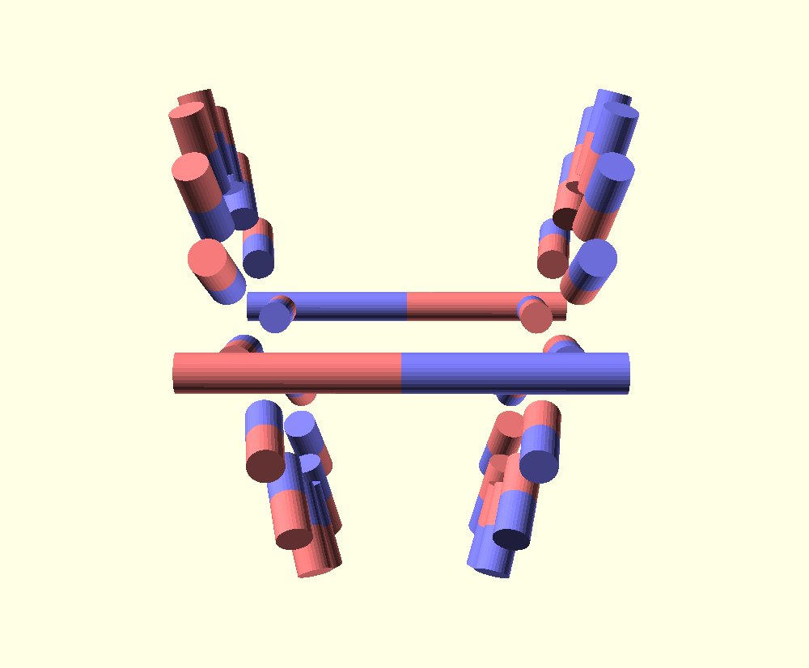

# V-Gate Disco

3D printable artwork that resembles a perpetual
motion magnetic motor which I haven't (yet) tried
to build.

It was assembled with 32 magnets per disc.
Dimension of each magnet is D=6mm and H=10mm.
Discs didn't rotate by themself when external magnet
is approaced. Torque was transferred to the axle and
not to the discs.

